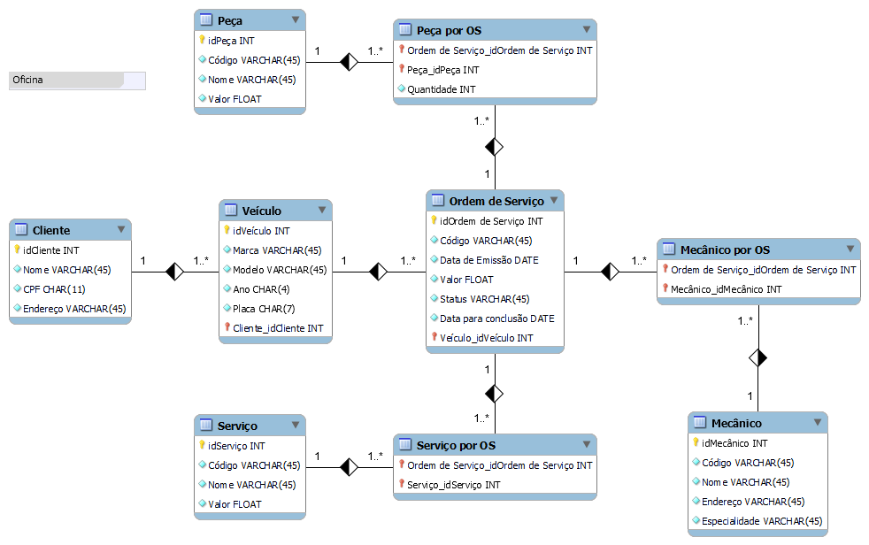

# 🎓 Desafio DIO 🎓

## "Construindo um esquema conceitual para banco de dados"

Projeto prático com objetivo de criar um projeto conceitual de banco de dados para uma oficina utilizando MySQL Workbench e os conhecimentos adquiridos até o momento no Bootcamp Database Experience.

